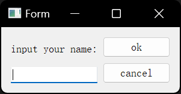
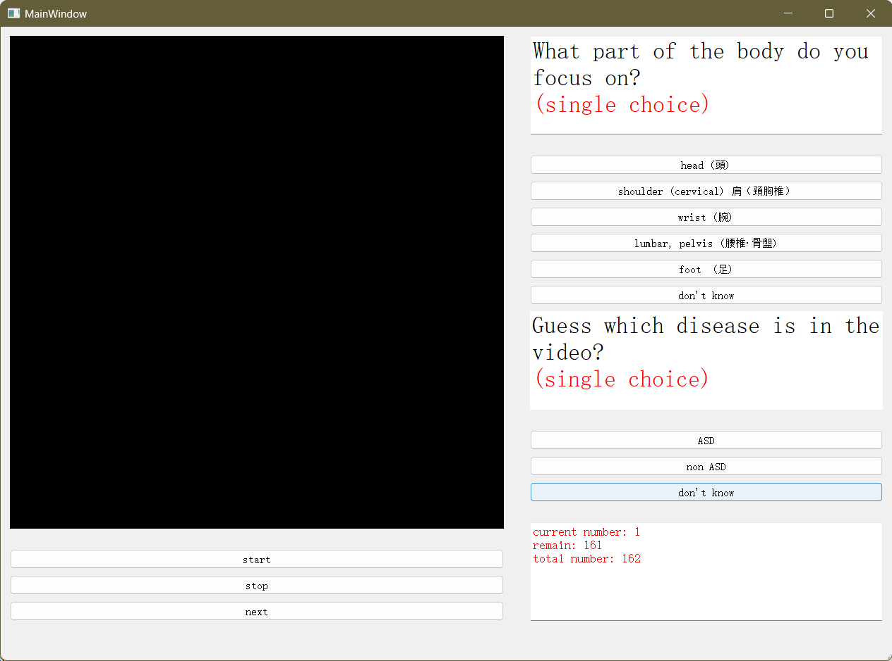

<div align="center">

# Interface for Adult Spinal Deformity

</div>

## Description

This project make the GUI for displaying the image-text model's prediction result.

Detailed comments are written for most of the functions and classes.
Have a happy code. 😄

## Folder structure

```bash
.
|-- README.md # This file
|-- UI
|   |-- GUI.py
|   |-- GUI.ui
|   |-- login.py
|   |-- login.ui
|   |-- video_player.py
|   `-- video_player.ui
|-- arduino_r4
|   `-- test.ino
|-- arduino_serial.py
|-- assets
|   |-- llm_res
|       |-- test1\ copy.json
|       `-- test1.json
|-- build.py
|-- img
|   |-- login_form.png
|   `-- main_window.png
|-- main.py
|-- misc
|   `-- LAVFilters-0.73.1.exe
|-- requirements.txt
|-- video_player_cv2.py
`-- video_player_qmedia_player.py
```

## How to run

1. This is login form, here you should input your name.

   

2. This is the main window, here you should select the predicted disease type and attnetion body part.

   The video is shown on the left and the options are on the right.
   Above on the right are the options for the attention part and below on the right are the options for disease prediction.

   

3. The final result will generated in [logs/](logs/), such as format: /logs/your_name_data.csv

## Installation

We use OpenCV and PyQt5 to build the GUI.

<!-- Because of this function can only decoder the .avi video file, but we have .mp4 video file.
So we need to install additional decoders, where locate in [LAVFilters](misc/LAVFilters-0.73.1.exe)

⚠️ Need first to install the additional decoder, otherwise an error will reported!
-->

Make sure you install the PyQt5 and OpenCV libraries before running the code.
You can install them with the following commands:

```bash
pip install PyQt5
pip install opencv-python
```

or you can install all the requirements in [requirements.txt](requirements.txt):

## PyInstaller

In [build.py](build.py), can use PyInstaller to compile the .py file to .exe app.
For the final user.

> ⚠️ Users should first check the **manual.docx** document to see how to use this application.
