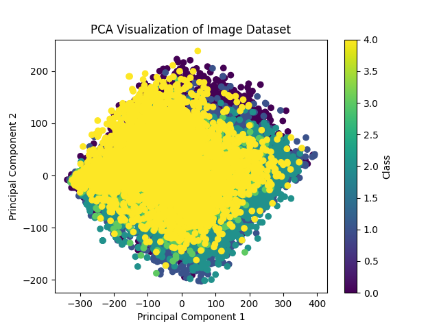
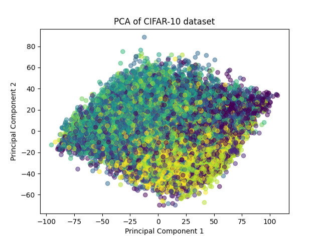

# Workflow 

1. Collect images from the Internet, meanwhile try to use the DF model to generate images.
2. Label the images by human, and prepare the dataset.
3. make the code of the system.
    1. make the dataloaer.
    2. make the model with different CV model.
    3. make the loss function.
4. Train the model.
5. Test the model.


# log

## 2023-12-3

之前写好了数据集的划分代码，放在
```
./dataset_collection/prepare_dataset.py
```
里面，并且把准备好的数据集放在
```
./data/splited_dataset
```
里面。
其中，`./data`数据集里面包含所有的训练使用数据。
```
./data
├── download # raw data from python crawler
├── splited_dataset # splited dataset, in train/val/test, splited by 7:2:1
└── temp_dataset # a temp dataset, help merge the whole class from download
```

整体数据集准备的处理流程如下：


**但是，训练之后的结果并不好。**

val loss很大，并且val acc很低，只有0.14左右。
train loss 和 train acc都很高，但是val loss很高，说明模型过拟合了。

具体原因还在分析中，不知。

之后尝试使用了PCA降维，但是效果并不好，因为没有经过分类器的缘故，出来的图片特征都集中在一起。

我们数据集的PCA分布如下：


为了确定是否正确，我使用同样的方法对cifar10进行了PCA，结果如下：


可以看到是没有什么区别的，猜测的原因是因为我们的数据没有经过分类器，所以效果不好。

~~PS: 找时间写一下数据的分布图。~~
17:40:34：
已解决，观察数据分布发现存在数据不均衡的问题，所以在数据集划分的时候，需要注意数据的均衡性。
结果在`./dataset_collection/analyse/data_distributed.ipynb`下。